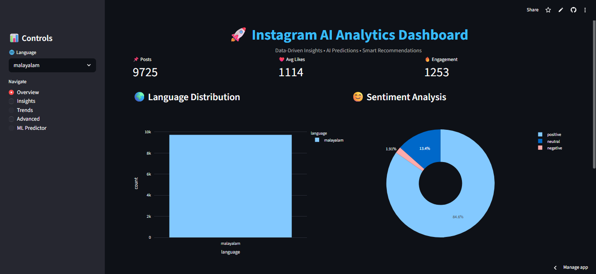

# 🚀 Instagram AI Analytics Dashboard

------------------------------------------------------------------------

## 🌐 Live Demo

👉 https://insta-dashboard-atsyktnhe4937eqzsa5twu.streamlit.app/

------------------------------------------------------------------------

## 📌 Project Overview

This project is a premium AI-powered analytics dashboard designed to
analyze large-scale Instagram data (500,000+ posts). It integrates
**data visualization, social network analysis, dimensionality reduction
(t-SNE), and machine learning** to extract actionable insights from
social media behavior.

------------------------------------------------------------------------

## 🎯 Objectives

-   Analyze engagement trends\
-   Identify patterns using hashtags, language, and time\
-   Visualize high-dimensional data\
-   Apply machine learning for prediction\
-   Build an interactive dashboard

------------------------------------------------------------------------

## 🖼️ Dashboard Preview

------------------------------------------------------------------------

## 🧠 Core Concepts

### 🔹 Online Social Networks

Social media is modeled as a network: - Nodes → posts, hashtags\
- Edges → relationships

Used for: - Trend detection\
- Cluster analysis\
- Engagement understanding

------------------------------------------------------------------------

### 🔹 t-SNE (t-Distributed Stochastic Neighbor Embedding)

A dimensionality reduction technique used to visualize high-dimensional
data.

-   Preserves similarity\
-   Reveals clusters\
-   Useful for text embeddings

------------------------------------------------------------------------

### 🔹 Advanced Visualizations

Includes: - Bar charts\
- Pie charts\
- Scatter plots\
- Histograms\
- Heatmaps\
- Correlation matrices

------------------------------------------------------------------------

## ⚙️ Methodology

1.  Data preprocessing\
2.  Feature extraction\
3.  Exploratory Data Analysis (EDA)\
4.  Dimensionality reduction using t-SNE\
5.  Machine learning model (Linear Regression)\
6.  Dashboard development using Streamlit

------------------------------------------------------------------------

## 📊 Key Features

### 📈 Analytics

-   Language distribution\
-   Sentiment analysis\
-   Engagement trends

### 🔥 Insights

-   Best posting time\
-   Hashtag performance\
-   Caption optimization

### 🤖 Machine Learning

-   Engagement prediction\
-   Inputs: hashtag count, caption length

### 🌐 Dashboard

-   Sidebar navigation\
-   Interactive charts\
-   Real-time filtering

------------------------------------------------------------------------

## 🏗️ System Architecture

Raw Data\
↓\
Data Preprocessing\
↓\
Feature Engineering\
↓\
EDA & Visualization\
↓\
t-SNE\
↓\
Machine Learning\
↓\
Streamlit Dashboard\
↓\
User Insights

------------------------------------------------------------------------

## 🧪 Tech Stack

  Category        Tools
  --------------- ------------------
  Frontend        Streamlit
  Data            Pandas, NumPy
  Visualization   Plotly
  ML              Scikit-learn
  NLP             TF-IDF, Word2Vec

------------------------------------------------------------------------

## ▶️ Run Locally

pip install -r requirements.txt\
python -m streamlit run app.py

------------------------------------------------------------------------

## 📁 Project Structure

karts-dashboard/\
├── app.py\
├── requirements.txt\
├── README.md\
├── run.sh\
├── instagram_preprocessed.csv

------------------------------------------------------------------------

## 📊 Key Insights

-   Engagement increases with optimal hashtag usage\
-   Posting time significantly impacts reach\
-   Caption length influences performance\
-   Likes strongly influence engagement

------------------------------------------------------------------------

## 💡 Applications

-   Social media analytics\
-   Marketing optimization\
-   Trend detection\
-   Content strategy

------------------------------------------------------------------------

## 🏆 Highlights

-   End-to-end analytics pipeline\
-   AI + Visualization integration\
-   Interactive dashboard\
-   Live deployment\
-   Portfolio-ready project

------------------------------------------------------------------------

## 🚀 Future Scope

-   Deep learning models\
-   Real-time data integration\
-   AI chatbot\
-   Cloud deployment
